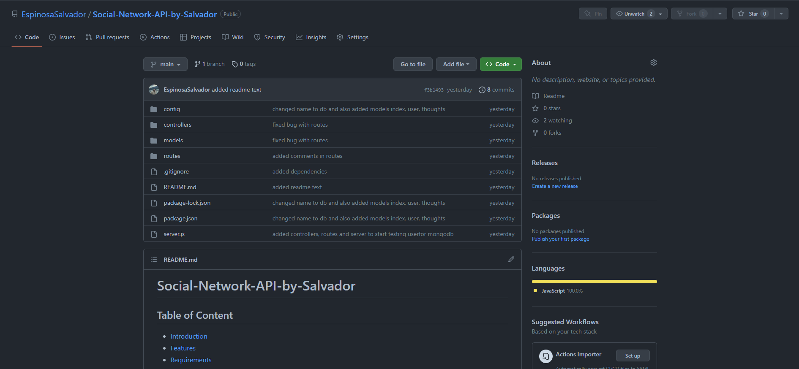
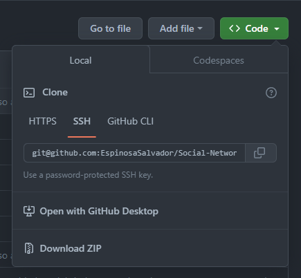
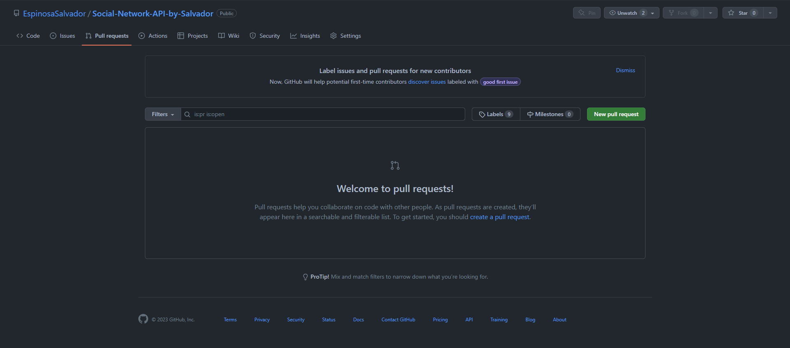
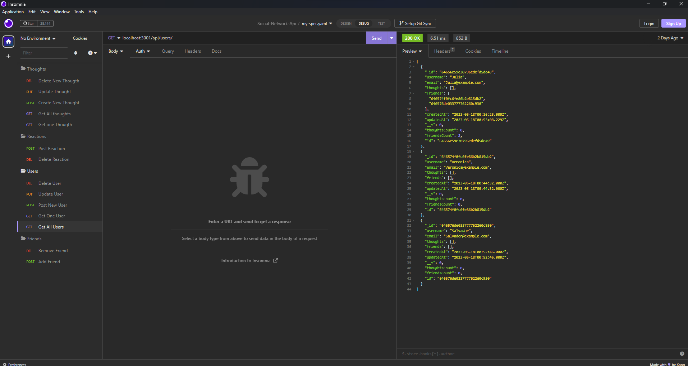
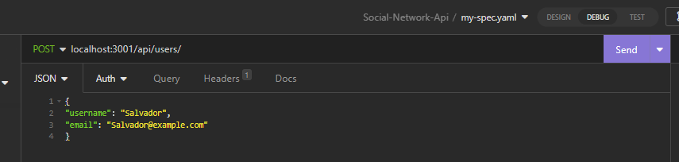
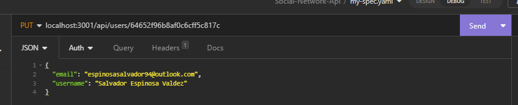
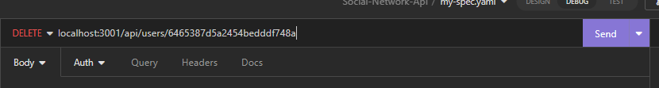
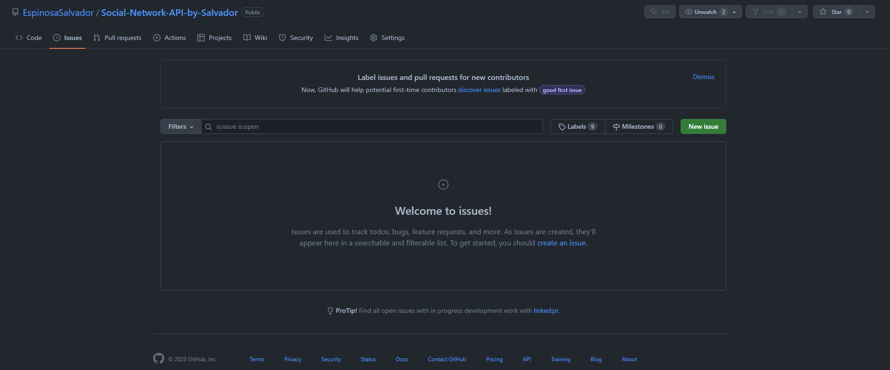

# Social-Network-API-by-Salvador

## Table of Content

- [Introduction](#introduction)
- [Features](#features)
- [Requirements](#requirements)
- [Installation](#installation)
- [Video](#video)
- [Configuration](#configuration)
- [What you should be able to see](#what-you-should-be-able-to-see)
- [Troubleshooting](#troubleshooting)
- [Next Phase Development](#next-phase-development)
- [FAQ (Frecuently Asked Questions)](#faq-frecuentrly-asked-questions)
- [Team](#team)

## Introduction

Welcome to the Social-Network-application. this application allows users to write, save, update, delete and create new information though API Receivers the one that I used was Insomnia.

[Link to my Github Repository](https://github.com/EspinosaSalvador/Social-Network-API-by-Salvador)

## Features

This app is suppose to be used at the same time with Insomnia so we can add, update, eliminate the db. this will be more intuitive for the user.

- View all Users, or only see one specific one, update, or delete.
- View all Thoughts, or only see a specific one, update, or delete.
- Create thoughts or reactions and see a specific one, or delete.

## Requirements

- Node.js installed on the system
- express to version 4.18.2
- mongoose to version 7.1.1
- moment to version 2.29.4 for the dates and so on

## Installation

To install this project please proceed to my [GitHub Repository](https://github.com/EspinosaSalvador/Social-Network-API-by-Salvador)

you should be able to see this,



Click on code as shown in the image



Copy the SSH key or the HTTPS key and open.

- Terminal
- Git bash
- CMD

either one of this will work. please proceed to the terminal an put in your Terminal,

```
git clone git@github.com:EspinosaSalvador/Social-Network-API-by-Salvador.git
```

and now you have a copy of the code.

you can work/play/use the app

## Video

if you want to watch my walkthorough please click on the video. we are doing the same steps that were previously stated.

[](https://drive.google.com/file/d/1b7yCGlJOYM1VYu-3L8sZlcJY9TpGsmFE/view)

## Configuration

If you want to do any configurations on this project please open a new branch you can do this by putting the following code in your terminal,

```
git checkout -b ＜new-branch＞
```

switch branches putting the following code on your terminal.

```
git checkout ＜branchname＞
```

If you want to show us your code and merge please open a pull request on

[Github](https://github.com/EspinosaSalvador/Social-Network-API-by-Salvador/pulls).



## What you should be able to see

To start this app please use

```
npm i
```

to install the dependencies that we have on the package.json after that please use

```
npm start
```

this will start the server and now you will be able to use insomnia to add/remove/update/connect your data



lets open our insomnia app in the computer and lets start playing with the js.

for this expample we will be going with adding users and friends. but if you feel you need more explanation please go to my Video which is above for a more complete explanation, on how to use this app.

please input in the url what you see in the img, below.


the image above show us what we need to input inside the url to see our work in this example we are using the get to see all users with get.

lets proceed by seeing the url that we need to input to see only one category



as you can see above is pretty similar the difference is that we are on the section to post and also, we need to add

- username
- email



we need to repeat what we have on post in case we want to upadte both.

but this time we need to add the id of the user. in the url to make the application know which user we are going to upadate.

to see if this works please go back to your get section and see if this is updated.



to delete the user we need the id after user in the url.

and repeat the same process with friends, thoughts and reactions.

## Troubleshooting

The Employee-Tracker is in version 1.0, please let me know if there are anybug in the webpage by issuing it in [Github](https://github.com/EspinosaSalvador/Social-Network-API-by-Salvador/issues)



## Next Phase Development

This are will be updated depending on the feedback from the users.

## FAQ (Frecuentrly Asked Questions)

We will update this part when we have some frequently asked question.

## Team

- Salvador Espinosa Valdez
